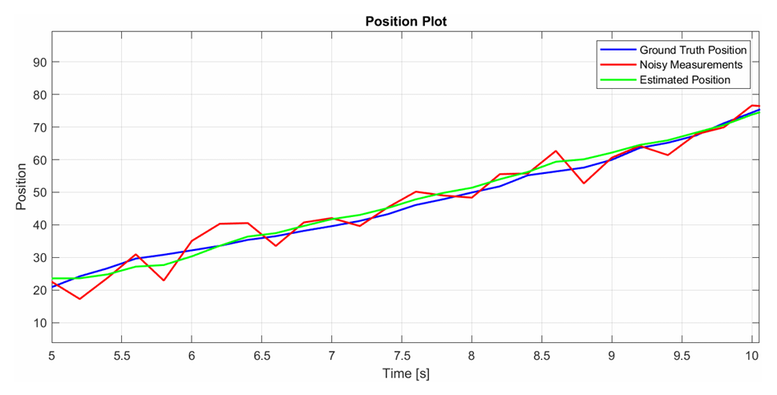
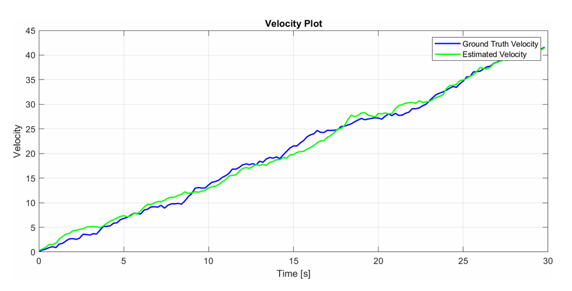

# 1D Motion Estimation with Kalman Filter

This repository contains a Simulink-based implementation of a **Kalman Filter** for estimating the **position** and **velocity** of a vehicle moving in one dimension using noisy sensor measurements.

## Project Overview

The system models a vehicle receiving torque inputs and simulates its one-dimensional motion. A Kalman Filter is used to estimate the state vector:

$$
x = \begin{bmatrix} \text{position} \\ \text{velocity} \end{bmatrix}
$$

The goal is to reconstruct accurate state estimates using:

* **Noisy position measurements** (GPS-like)
* **Known system dynamics** based on torque input and mass

## Features

* Full implementation of a **discrete Kalman Filter** in Simulink
* Separation of **prediction** and **update** steps into distinct Simulink subsystems

## Included Files

* `kalman_filter_data.mat`: contains all simulation data and parameters
* Simulink model implementing the Kalman Filter
* MATLAB scripts for loading data
* Output graphs for result visualization

## How to Run

1. Open MATLAB and load the data.
2. Open and run the Simulink model (`kalman_filter.slx`).

## Output Plots

## Technical Notes

* Sample time: `dt` (loaded from `.mat` file)
* Solver: Fixed-step (step size = `dt`)
* Compatible with MATLAB **R2021a** 

